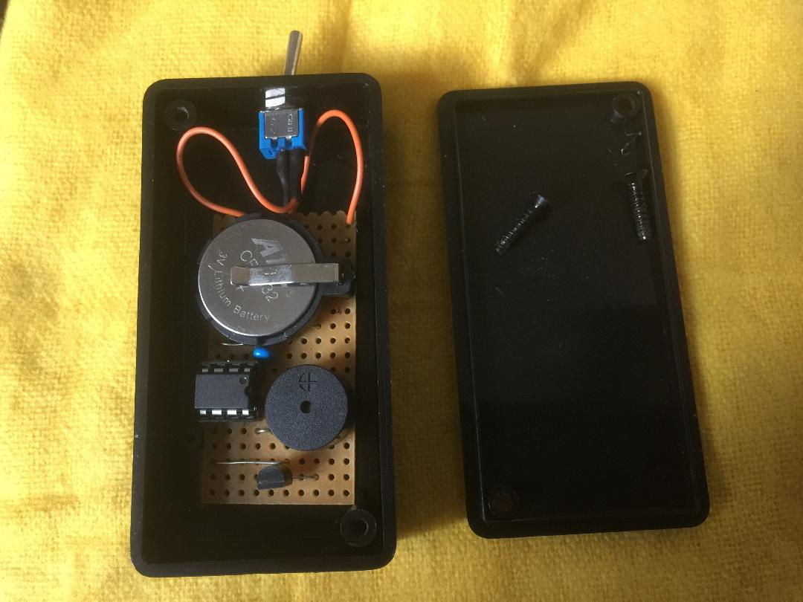
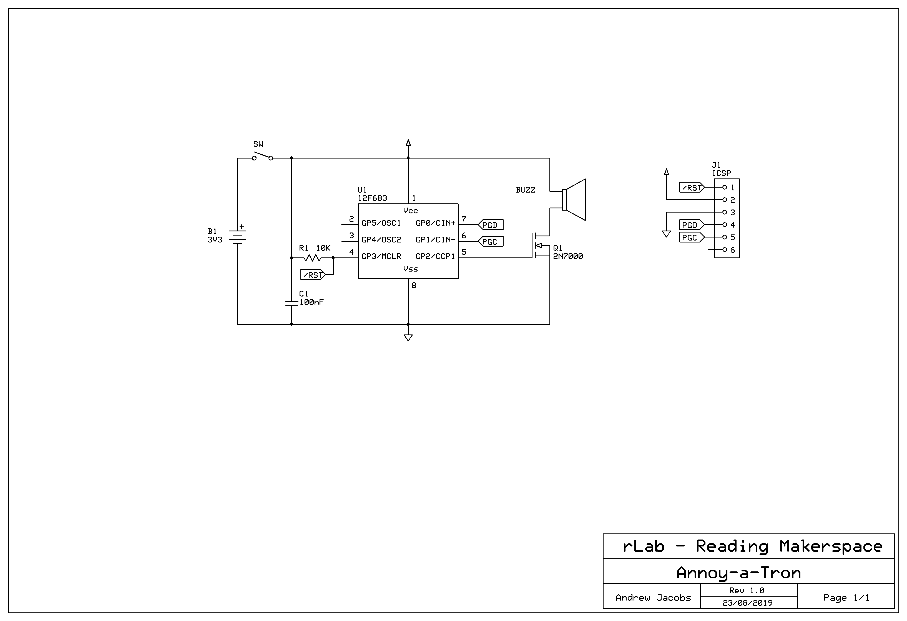

# Annoy-a-Tron
An 'Annoy-a-Tron' is a simple circuit that periodically makes a noise and then goes silent for a random period of time before making another noise.

I tested this circuit on one of my colleagues at work by Blutacking my prototype strip board circuit to the underside of his monitor stand. I told other people in the office to ignore any occaisional beeps and so whenever our victim heard a noise we said we couldn't.

It worked so well I made up two new modules in neat little plastic boxes and a few days later they spent the day beeping out of phase around his desk while we struggled to keep a straight face.

## How it works
My Annoy-a-Tron uses a PIC 12F683 micro-controller to generate the beeps but periodically allowing power to flow through a piezzo sounder.

To keep the power consumption low the chip spends most it time in a low power sleep state. The built in watchdog timer continues run in sleep mode and is used to wake the device up when it overflows (about every 30 seconds). A randomly initialised counter is used to count down the number of sleep periods (1 thru 32) until the next sound is to generated.

When it is time to make a noise another random number determines the number of beeps (1 thru 4). Then an new random sleep count is generated and the process repeats until its turned off or the battery runs out.

The complete circuit schematic is shown below, including the optional ICSP connections.

If you make one, let me know.